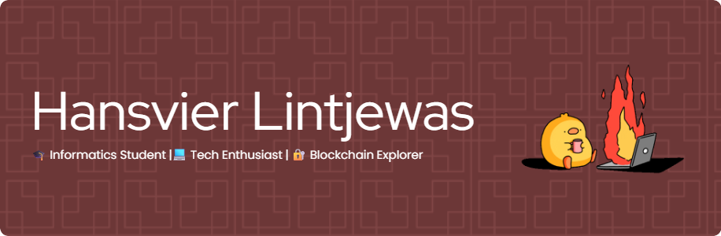

<!-- Banner -->

  

<h1 align="center">Hi 👋 Welcome to my profile guys </h1>
<h3 align="center">Enjoy to Coming</h3>

---

### ✨ About Me

> Di antara ribuan baris kode dan deretan tugas yang tak berujung,  
> aku menemukan makna dalam proses, bukan sekadar hasil.  
>  
> Mahasiswa Teknik Informatika di Universitas Putera Batam,  
> yang bekerja sebagai Operator Produksi di siang hari,  
> dan membangun mimpi digital di malam hari.  
>  
> Tertarik pada teknologi, keamanan siber, dan dunia blockchain.  
> Bekerja dengan tangan, berpikir dengan hati, dan bermimpi dengan logika.  
>  
> Mari kita mulai membangun, satu baris kode dalam satu waktu. 🚀

---

### 💻 Tech Stack & Tools

#### Programming & Development
- 🖋️ HTML, CSS, JavaScript
- ⚙️ PHP & Laravel
- ☕ Java (OOP)
- 🛢️ MySQL

#### Dev Tools & OS
- 🧪 Git, Terminal
- 🐧 Linux OS

#### UI/UX & Design
- 🎨 Figma
- 🖼️ Canva
- 🧪 Adobe Photoshop

#### Productivity & Office Tools
- 📄 Word (Document Architect)
- 📊 Excel (Data Crafter)
- 📽️ PowerPoint (Slide Alchemist)
- 🧠 Notion (Workflow Wizard)

---

### 📚 Currently Learning
- 🔐 Network & Web Security
- 🔗 Blockchain Technology
- 🧱 Smart Contract Development
- 📦 Clean Code & API Integration

---

### 🎸 Fun Facts
- 🎶 I love slow pop songs and often sing while playing guitar.
- 🎮 I'm also a casual gamer when I’m not coding or designing.
- 🌱 Always hungry to learn, fail, fix, and grow.

---

### 💬 Motto

> _"Discipline, faith, and passion lead to great things."_  
> _Progress over perfection, every day._

